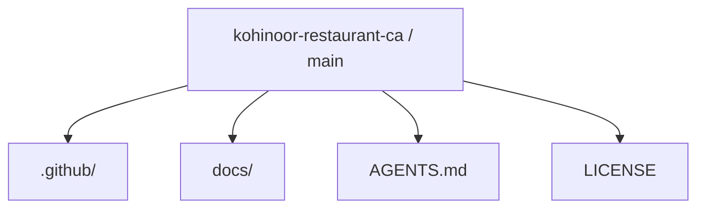
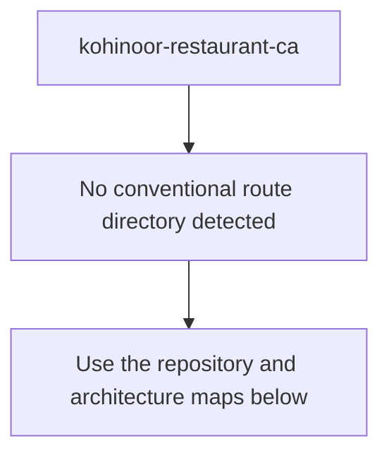
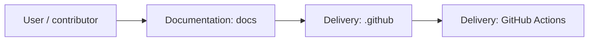
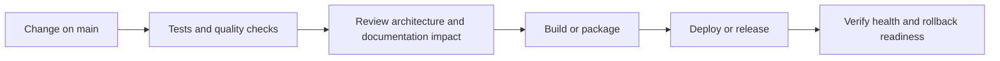
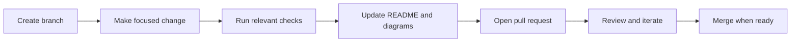

<!-- interactive-readme-standard:start -->

<div align="center">

# kohinoor-restaurant-ca

**Branch-aware technical guide for [`main`](https://github.com/Nischhalsubba/kohinoor-restaurant-ca/tree/main)**

<p>  </p>

<p>
  <a href="https://github.com/Nischhalsubba/kohinoor-restaurant-ca/tree/main"><strong>Browse source</strong></a> ·
  <a href="https://github.com/Nischhalsubba/kohinoor-restaurant-ca/issues"><strong>Issues</strong></a> ·
  <a href="https://github.com/Nischhalsubba/kohinoor-restaurant-ca/codespaces/new?ref=main"><strong>Open in Codespaces</strong></a>
</p>

</div>

> [!IMPORTANT]
> This guide is generated from the files actually present on `main`. It links to detected source paths, preserves project-authored notes, and avoids claiming components that were not found.

## At a glance

| Item | Detected value |
|---|---|
| Purpose | Branch-specific project documentation generated from the repository structure without inventing missing capabilities. |
| Branch role | Default branch |
| Stack | No primary framework detected automatically |
| Manifests | No standard manifest detected |
| Prerequisites | Confirm from the detected manifests |
| Delivery | GitHub Actions |
| License | LICENSE |

## Branch scope

This is the repository's default branch.


## Quick start

> No reliable setup command was detected. Use the preserved project-authored notes and manifests rather than guessing.

### Configuration surface

- No committed environment example file was detected.

> Never commit secrets, private keys, production credentials, customer data, or unredacted infrastructure details.

## Repository map



| Responsibility | Detected source paths |
|---|---|
| Documentation | [`docs`](https://github.com/Nischhalsubba/kohinoor-restaurant-ca/tree/main/docs) |
| Delivery | [`.github`](https://github.com/Nischhalsubba/kohinoor-restaurant-ca/tree/main/.github) |

## Website or application map



## Architecture and responsibility flow




## Quality, security, and operations

<table>
<tr>
<td width="33%" valign="top">

### Quality

- No conventional test directory was detected automatically.

Detected commands:
- No standard quality command detected.

</td>
<td width="33%" valign="top">

### Security

- No dedicated security policy or automated dependency configuration was detected.

Review authentication, authorization, input validation, dependency updates, secret handling, and failure recovery before release.

</td>
<td width="34%" valign="top">

### Observability

- No dedicated observability integration was detected automatically.

Define useful logs, metrics, traces, alerts, and rollback signals for production-facing branches.

</td>
</tr>
</table>

## Delivery flow



### Automation detected

- [`.github/workflows/apply-interactive-readme.yml`](https://github.com/Nischhalsubba/kohinoor-restaurant-ca/blob/main/.github/workflows/apply-interactive-readme.yml)

## Contribution flow



- Keep changes focused and explain architectural consequences.
- Run the checks relevant to the changed area.
- Update diagrams whenever routes, modules, data models, authentication, jobs, or delivery paths change.
- Add screenshots or recordings for visual behavior changes when useful.
- Use issues for reproducible defects and pull requests for reviewable changes.

## Ownership and support

| Topic | Source |
|---|---|
| Repository | [`Nischhalsubba/kohinoor-restaurant-ca`](https://github.com/Nischhalsubba/kohinoor-restaurant-ca) |
| Branch | [`main`](https://github.com/Nischhalsubba/kohinoor-restaurant-ca/tree/main) |
| Ownership | No CODEOWNERS file detected |
| Contributing | Use the contribution flow above |
| Support | [Open or review issues](https://github.com/Nischhalsubba/kohinoor-restaurant-ca/issues) |
| License | [`LICENSE`](https://github.com/Nischhalsubba/kohinoor-restaurant-ca/blob/main/LICENSE) |

<details>
<summary><strong>Documentation maintenance checklist</strong></summary>

- [ ] Purpose and branch scope are accurate.
- [ ] Setup and configuration commands still work.
- [ ] Repository, application, API, data, authentication, job, and deployment diagrams match the code.
- [ ] Tests, security controls, observability, and rollback behavior are documented.
- [ ] Links point to real files on this branch.
- [ ] No secrets or private operational details are exposed.

</details>

<!-- interactive-readme-standard:end -->

<!-- project-authored-notes:start -->
<details>
<summary><strong>Project-authored notes preserved from this branch</strong></summary>

<div align="center">

# Kohinoor Restaurant CA

### Restaurant Website for Menu, Location, and Contact Discovery

**A static restaurant website concept for Kohinoor Restaurant in Canada, designed to showcase menu items, food photography, location details, reservation/contact information, and a clean responsive dining experience.**


</div>

---

## ✨ Overview

**Kohinoor Restaurant CA** is a restaurant website concept for presenting menu items, cuisine photography, restaurant location, contact information, and reservation-oriented content.

The project is structured as a simple static frontend website that can be customized for a restaurant, cafe, takeaway business, or food brand.

---

## 🧭 Table of Contents

- [Project Purpose](#-project-purpose)
- [Designer’s Perspective](#-designers-perspective)
- [Suggested Sections](#-suggested-sections)
- [Features](#-features)
- [Tech Stack](#-tech-stack)
- [Run Locally](#-run-locally)
- [Deployment](#-deployment)
- [Quality Checklist](#-quality-checklist)
- [Roadmap](#-roadmap)
- [License](#-license)

---

## 🎯 Project Purpose

The website is intended to help visitors quickly answer common restaurant questions:

- What food does the restaurant serve?
- Where is it located?
- How can I contact or reserve?
- What does the food/place look like?
- What are the featured dishes?

---

## 🎨 Designer’s Perspective

A restaurant website should be appetizing, quick to scan, and action-oriented.

The most important UX priorities are:

- visible menu access
- strong food photography
- clear location/contact details
- mobile-friendly layout
- easy reservation or order CTA
- readable dish names and prices
- trust signals such as gallery, testimonials, or reviews

---

## 🧱 Suggested Sections

| Section | Purpose |
|---|---|
| Hero | Restaurant identity and primary CTA |
| Menu | Dishes, categories, and prices |
| Gallery | Food and restaurant photos |
| About | Short story or cuisine positioning |
| Location | Address, map, hours |
| Contact / Reservation | Booking or inquiry path |
| Footer | Social links and secondary details |

---

## 🌟 Features

| Feature | Description |
|---|---|
| Menu section | Present dishes and pricing |
| Food gallery | Showcase cuisine and ambience |
| Contact details | Help visitors call, email, or visit |
| Reservation direction | Space for booking CTA or form |
| Bootstrap layout | Responsive website foundation |
| Static deployment | Easy hosting on any static platform |

---

## 🛠 Tech Stack

| Layer | Technology |
|---|---|
| Markup | HTML |
| Styling | CSS |
| Layout | Bootstrap |
| Interactions | JavaScript |

---

## 🚀 Run Locally

Clone the repository:

```bash
git clone https://github.com/Nischhalsubba/kohinoor-restaurant-ca.git
```

Open the main HTML file in a browser, or run:

```bash
python -m http.server 8000
```

Then visit:

```text
http://127.0.0.1:8000/
```

---

## 🌐 Deployment

Deploy the site to:

- GitHub Pages
- Netlify
- Vercel
- Cloudflare Pages
- shared hosting / cPanel

---

## ✅ Quality Checklist

- [ ] Menu items are current.
- [ ] Prices are accurate.
- [ ] Restaurant address is correct.
- [ ] Opening hours are accurate.
- [ ] CTA buttons work.
- [ ] Gallery images are optimized.
- [ ] Images have alt text.
- [ ] Mobile layout is easy to use.
- [ ] Contact/reservation form is connected or clearly marked.

---

## 🗺 Roadmap

- Add online reservation integration.
- Add customer testimonials.
- Add Google Maps embed.
- Add ordering/delivery links.
- Add SEO metadata and Open Graph preview.
- Add menu PDF download.
- Add structured data for restaurant SEO.

---

## 📜 License

This project is licensed under the **MIT License**.

---

<div align="center">

A restaurant website foundation built for menu clarity, food appeal, and quick customer action.

</div>

</details>
<!-- project-authored-notes:end -->
