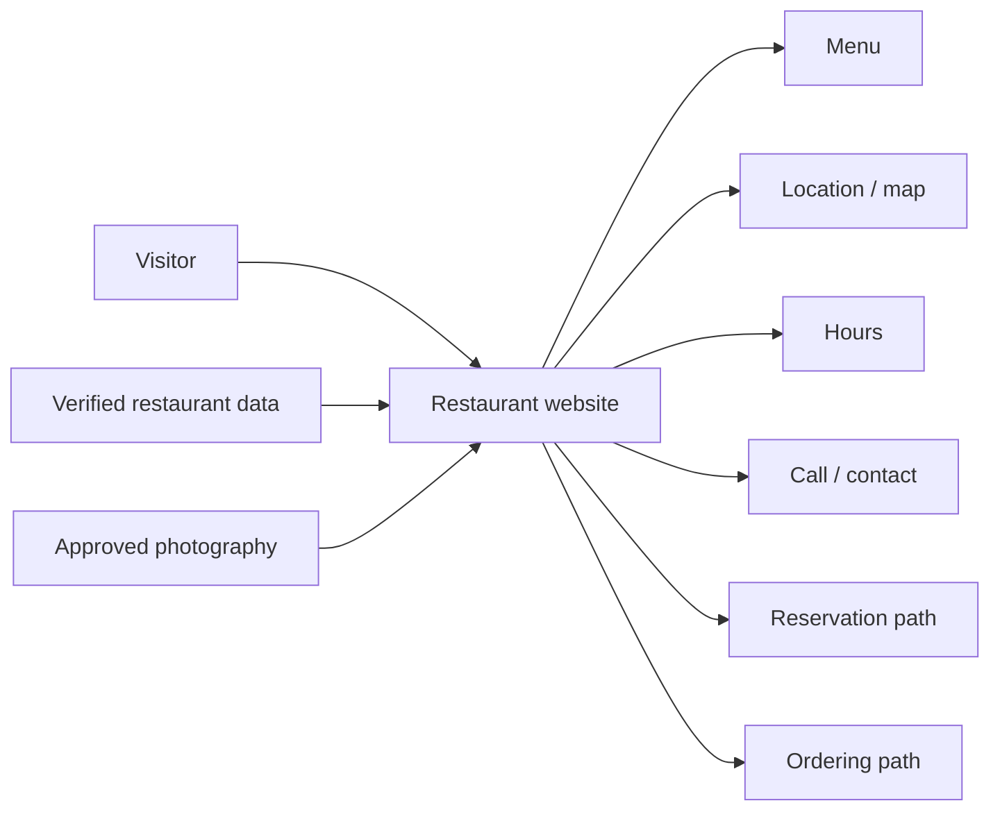
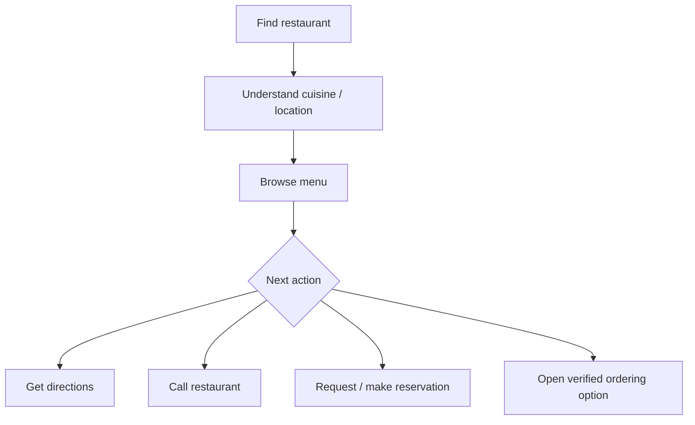
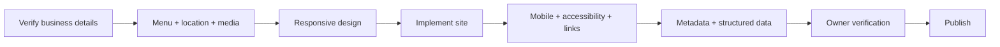

<div align="center">

# 🍽️ Kohinoor Restaurant CA

**A retained restaurant-website concept repository focused on clear menus, location and contact paths, mobile usability, trustworthy business information, and future restaurant discovery.**


[Repository overview](./docs/REPOSITORY_OVERVIEW.md) · [Detailed docs](./docs/README.md) · [Issues](https://github.com/Nischhalsubba/kohinoor-restaurant-ca/issues)

</div>

## Overview

Kohinoor Restaurant CA is currently a **restaurant website concept repository**, not a runnable or deployed restaurant website. The historical static implementation is not present on the current branch, so any future rebuild should begin from verified restaurant information instead of recycling stale or invented business details.

| Audience | What matters most |
|---|---|
| Diners | Menu, location, hours, contact, ordering and reservation clarity |
| Designers | Mobile-first discovery, readable menu content and obvious primary actions |
| Developers | Accessible static or dynamic implementation and maintainable business data |
| Restaurant owners / content teams | Accurate prices, hours, address, phone, ordering and reservation details |

<details open>
<summary><strong>🏗️ Interactive restaurant architecture</strong></summary>



</details>

## Visitor flow



## Current repository structure

```text
kohinoor-restaurant-ca/
├── docs/
│   ├── assets/
│   ├── REPOSITORY_OVERVIEW.md
│   └── README.md
├── LICENSE
└── README.md
```

There is no active website implementation on the current branch.

## Business-data requirements

Before publishing any future implementation, verify the restaurant name, address, phone, email, opening hours, menu items, prices, taxes, allergen information, map location, reservation rules and ordering links with the business. Do not invent reviews, awards, availability, prices or opening hours.

## Design and implementation principles

- Keep menu content available as real HTML rather than image-only text.
- Make call, map, menu, reservation and ordering actions easy to reach on mobile.
- Clearly distinguish a reservation **request** from a confirmed booking.
- Do not imply live table or order availability without a real integration.
- Use accessible form labels, focus states, semantic headings and useful image alternatives.
- Confirm photography ownership and permissions before release.

## SEO and local discoverability

A future live restaurant site should use verified location and business language such as **restaurant name, cuisine, city or neighborhood, restaurant menu, dining, reservations, takeout or delivery** only where those services are actually offered. Maintain accurate title tags, descriptions, contact details, opening hours, map references and restaurant structured data. Local SEO is useful only when the underlying business information is correct, a surprisingly demanding standard for the internet.

## Launch flow



See [`docs/README.md`](./docs/README.md) for detailed repository guidance.
