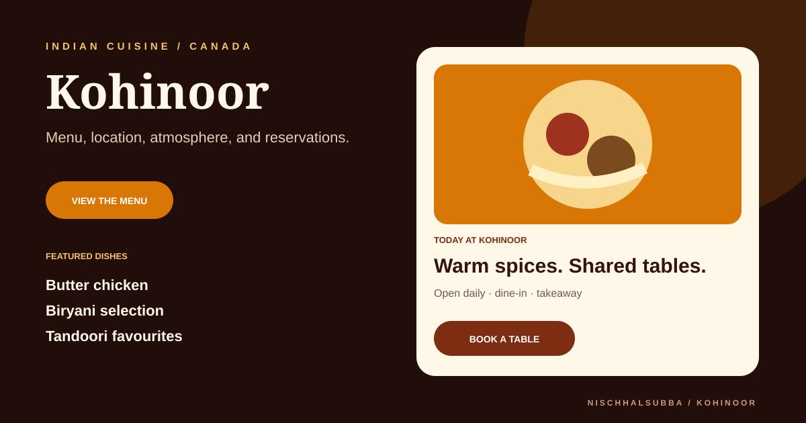

# Kohinoor Restaurant Repository Overview

## Classification

Static restaurant website concept for menu, gallery, location, contact, and reservation discovery.

- Stack: HTML, CSS, Bootstrap, and JavaScript
- Deployment: not verified
- Business information: must be checked before public use
- Fresh screenshot: not captured because public hosts were unreachable
- Visual above: original concept thumbnail, not a browser screenshot

## Highest-priority checks

1. Verify business name, address, hours, menu, prices, phone, and reservation links.
2. Replace placeholder food imagery with licensed restaurant media.
3. Add Restaurant structured data only with accurate details.
4. Test mobile menu, call, map, reservation, and ordering actions.
5. Add accessible alt text, form labels, metadata, and Open Graph information.